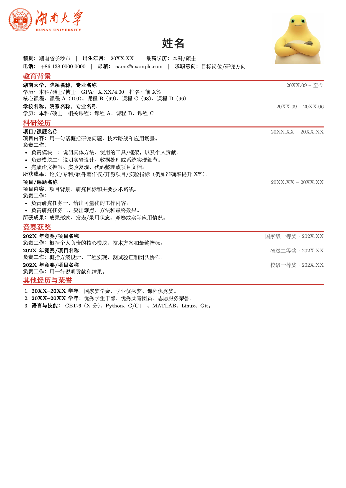

# 湖南大学个人简介模板

这是一个单页 A4 中文 LaTeX 个人简介模板。页面采用红色标题和横线，左上角显示湖南大学 logo，右上角为证件照。内容依次为基本信息、教育背景、科研经历、竞赛获奖和其他经历与荣誉。

## 效果预览



## 目录结构

```text
HNU_profile_template/
├── assets/
│   └── preview.png                 # README 效果截图
├── logo/
│   ├── hnu_logo.png                 # 原始 logo
│   ├── hnu_logo_white.png           # 白底版本
│   └── hnu_logo_white_cropped.png   # 模板实际使用的版本
├── photo/
│   └── photo.jpg                    # 可选：自行放入证件照
└── template/
    ├── hnu_profile.tex              # 可编辑的 LaTeX 源文件
    ├── hnu_profile.pdf              # PDF 预览
    └── README.md                    # 模板补充说明
```

`photo/photo.jpg` 提供可爱的nailoong案例。没有该文件时，模板会显示照片占位框。若需显示证件照，将 JPG 图片命名为 `photo.jpg` 并放入 `photo/`，然后重新编译。图片和 logo 的路径均以 `template/` 为编译工作目录。

## 使用方法

1. 打开 `template/hnu_profile.tex`，替换姓名、联系方式、教育和项目经历等示例文字；按需复制或删减相应条目。
2. 如需证件照，放入 `photo/photo.jpg`。
3. 安装带有 `ctex` 的 TeX Live 或 MacTeX，在项目根目录执行：

   ```bash
   cd template
   xelatex -interaction=nonstopmode -halt-on-error hnu_profile.tex
   ```

生成的 PDF 位于 `template/hnu_profile.pdf`。请使用 XeLaTeX 编译，并从 `template/` 目录运行命令，以便正确找到 `../logo/` 和 `../photo/` 中的图片。

页眉中 logo、姓名和照片的位置及尺寸位于 `.tex` 文件开头的 `tikzpicture` 块；红色标题与横线的样式由 `\profilesection` 定义。修改内容后建议检查导出的 PDF，确认照片及较长文字没有遮挡或溢出。
